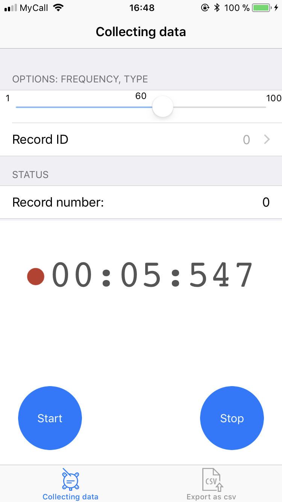
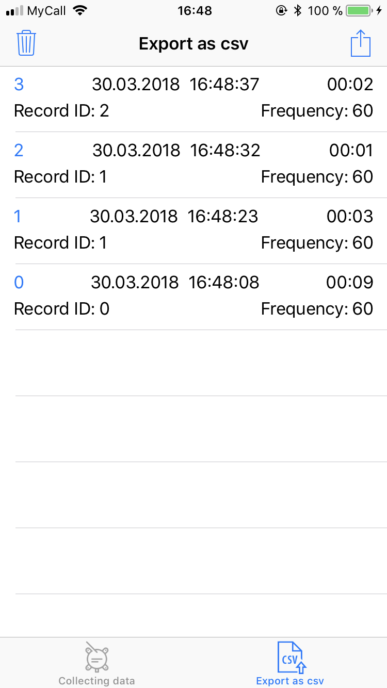

# MotionCollector
iOS app for collecting data from internal motion sensors (gyroscope, magnetometer, accelometer). 
The result could be exported as *.csv file that contains all the sessions.

# Screenshots

  
  

