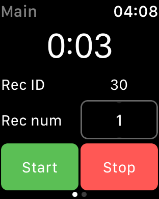
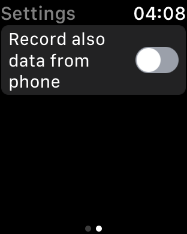

# MotionCollector
iOS app for collecting data from iPhone's motion sensors (gyroscope, magnetometer, accelometer) and Apple Watch's sensors (gyroscope, accelopmeter). Each session could be marked by record id to distinguish what type of session recorded. For example, to mark running session as record id = 0 and walking session as record id = 1. The result could be exported as *.csv file that contains all the sessions. 

There are 3 regimes of working app: collecting data from phone, collecting data from watch and collecting data simultaneously from phone and watch. In the case of second and third regimes record id sets up by Apple Watch's app.

# Screenshots

  
  

  
  

